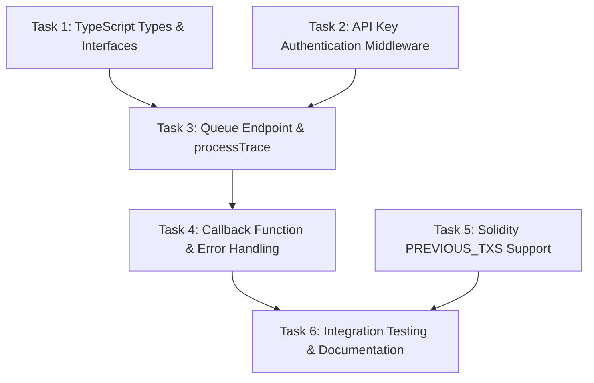

# Tracer Service Integration - Task Breakdown

Source PRD: [/Users/jacobdcastro/ph/tracer/docs/tracer-integration-prd.md](./tracer-integration-prd.md)
Created: 2026-01-07

## Overview

This document breaks down the Tracer Service Integration PRD into discrete, implementable tasks. The integration transforms the tracer from a blocking request-response API into a fire-and-forget system that accepts complete execution context, runs forge tests, and calls back with results. The breakdown prioritizes maintaining app stability between PRs and keeps changes under ~1000 lines per task.

**Key architectural points:**
- Fully stateless - no database or state management needed
- Reuses existing promise-chain queue serialization
- Bidirectional API key authentication
- Solidity test updates to handle previous transactions array

## Task Dependency Graph



## Tasks

---

### Task 1: TypeScript Types and Interfaces

**Priority**: High
**Estimated PR Size**: ~80-100 lines
**Dependencies**: None
**Type**: Backend

**Description**:

Define all TypeScript types and interfaces required for the new queue-based API. This includes the `TraceRequest` interface for incoming requests, callback payload types for success and failure responses, and supporting types for EVM transactions, access lists, and authorization tuples.

This task creates the type foundation that all subsequent tasks will depend on. By establishing types first, we enable better IDE support and type checking during development of the actual implementation.

**Technical Scope**:

- Create new file: `/Users/jacobdcastro/ph/tracer/types.ts`
- Define `TraceRequest` interface with all fields from PRD
- Define `TraceCallbackPayload` interface for callback responses
- Define `EVMTransaction` type for previous_transactions array
- Define `AccessListEntry` and `AuthorizationTuple` supporting types
- Define `BlockEnv` type for block environment context
- Export all types for use in `index.ts`

**Success Criteria**:

- [ ] All types from PRD are defined with proper TypeScript syntax
- [ ] Types are exported and can be imported in index.ts
- [ ] Types match the API contract specified in PRD exactly
- [ ] Optional fields are properly marked with `?`
- [ ] Type file compiles without errors (`bun build --compile`)

**Implementation Notes**:

- Use discriminated union pattern for transaction types (0-4) if needed
- Keep types in a separate file for maintainability
- Consider using `type` vs `interface` appropriately (prefer interface for extensibility)
- All numeric string fields should be typed as `string` per PRD (e.g., value, gas_limit)

**Types/Interfaces**:

```typescript
// Key types to define:
interface TraceRequest {
  rpc_url: string;
  callback_url: string;
  chain_id: number;
  transaction_hash: string;
  transaction: TransactionData;
  block_number?: number;
  previous_block_number?: number;
  previous_transactions?: EVMTransaction[];
  block_env?: BlockEnv;
}

interface TraceCallbackPayload {
  success: boolean;
  trace_content?: string;
  trace_format?: 'ansi' | 'plain' | 'json';
  error?: string;
  error_code?: string;
  duration_ms?: number;
  tracer_metadata?: Record<string, unknown>;
}
```

---

### Task 2: API Key Authentication Middleware

**Priority**: High
**Estimated PR Size**: ~60-80 lines
**Dependencies**: None
**Type**: Backend

**Description**:

Implement bidirectional API key authentication for the tracer service. This task adds authentication middleware for incoming requests from the dapp (checking `X-API-Key` header against `DAPP_API_KEYS` environment variable) and prepares the callback authentication mechanism (using `TRACER_CALLBACK_API_KEY`).

Authentication is critical for security and must be implemented before the queue endpoint is exposed. This task can be developed in parallel with Task 1 since they have no dependencies on each other.

**Technical Scope**:

- Create new file: `/Users/jacobdcastro/ph/tracer/auth.ts`
- Implement `validateApiKey()` function for constant-time key comparison
- Implement Hono middleware for authenticating `/api/queue` requests
- Add support for comma-separated keys in `DAPP_API_KEYS`
- Add logging for authentication failures (without logging actual keys)
- Document required environment variables

**Success Criteria**:

- [ ] Middleware correctly validates `X-API-Key` header
- [ ] Returns 401 Unauthorized for missing or invalid keys
- [ ] Supports multiple comma-separated keys in `DAPP_API_KEYS`
- [ ] Uses constant-time comparison to prevent timing attacks
- [ ] Logs authentication failures with request metadata (not keys)
- [ ] All tests pass

**Implementation Notes**:

- Use `crypto.timingSafeEqual()` for constant-time comparison
- Do NOT log the actual API key values - only log that auth failed
- Consider rate limiting in future task (not in scope here)
- The middleware should be reusable and easily applied to routes

**Types/Interfaces**:

```typescript
// Middleware signature
function authMiddleware(): MiddlewareHandler;

// Validation function
function validateApiKey(providedKey: string, validKeys: string[]): boolean;
```

---

### Task 3: POST /api/queue Endpoint and processTrace Function

**Priority**: High
**Estimated PR Size**: ~150-200 lines
**Dependencies**: Task 1, Task 2
**Type**: Backend

**Description**:

Implement the core queue endpoint that accepts trace requests and the `processTrace()` function that builds forge environment variables and runs traces. This is the main integration point that transforms the tracer from synchronous to fire-and-forget.

The endpoint validates the request, immediately returns 202 Accepted, and fires off the trace processing asynchronously. The `processTrace()` function builds the forge environment from the complete request data and uses the existing `enqueueForgeTestRun()` for serialization.

**Technical Scope**:

- Modify `/Users/jacobdcastro/ph/tracer/index.ts`
- Add `POST /api/queue` endpoint with authentication middleware
- Implement request validation for required fields
- Implement `processTrace()` function
- Build forge environment variables from request data
- Handle optional fields (nonce, gas_limit, block_env, previous_transactions)
- Serialize `previous_transactions` to JSON for `PREVIOUS_TXS` env var
- Handle all block_env fields including nullable prevrandao and blob gas

**Success Criteria**:

- [ ] Endpoint returns 202 with `{ status: "queued", message: "..." }` immediately
- [ ] Returns 400 for missing required fields with descriptive error
- [ ] Returns 401 for unauthorized requests (via middleware)
- [ ] `processTrace()` correctly builds all forge env vars
- [ ] Optional fields are handled correctly (not set if undefined)
- [ ] `PREVIOUS_TXS` is properly JSON stringified with correct field names
- [ ] Block env fields handle null values for prevrandao and blob_gas
- [ ] Uses existing `enqueueForgeTestRun()` for queue serialization
- [ ] Fire-and-forget pattern works (endpoint returns before trace completes)

**Implementation Notes**:

- The field name mapping in `PREVIOUS_TXS` must match Solidity struct expectations (`txFrom`, `txTo`, etc.)
- `previous_transactions` contains full EVM transaction objects (Types 0-4)
- Block env fields may be null for certain chains (pre-merge, non-blob)
- Do not await `processTrace()` - it runs in the background
- Consider adding request ID logging for debugging

**Types/Interfaces**:

```typescript
// Forge environment variable mapping
const forgeEnv: Record<string, string> = {
  FROM: request.transaction.from,
  TO: request.transaction.to || "",
  VALUE: request.transaction.value,
  CALLDATA: request.transaction.data || "",
  RPC: request.rpc_url,
  PREVIOUS_TX: request.transaction_hash,
  // ... additional fields
};
```

---

### Task 4: Callback Function and Error Handling

**Priority**: High
**Estimated PR Size**: ~80-100 lines
**Dependencies**: Task 3
**Type**: Backend

**Description**:

Implement the `sendCallback()` function that POSTs trace results back to the dapp's callback URL. This includes proper error handling, authentication headers, retry logic consideration, and comprehensive logging.

The callback must include the `X-API-Key` header using `TRACER_CALLBACK_API_KEY` and handle both success and failure scenarios. The function should be resilient to callback failures (log but don't crash).

**Technical Scope**:

- Modify `/Users/jacobdcastro/ph/tracer/index.ts` (or create `/Users/jacobdcastro/ph/tracer/callback.ts`)
- Implement `sendCallback()` function
- Add `X-API-Key` header from `TRACER_CALLBACK_API_KEY` env var
- Handle network errors gracefully (log, don't throw)
- Handle non-2xx responses (log status code)
- Integrate callback into `processTrace()` success and error paths
- Add timing/duration tracking for callbacks

**Success Criteria**:

- [ ] Callback POSTs to provided URL with correct JSON payload
- [ ] `X-API-Key` header is included from env var
- [ ] Success payload includes `trace_content`, `trace_format`, `duration_ms`
- [ ] Failure payload includes `error`, `error_code`, `duration_ms`
- [ ] Network errors are caught and logged (service doesn't crash)
- [ ] Non-2xx responses are logged with status code
- [ ] Duration is calculated from start of `processTrace()` to completion
- [ ] All error paths result in a callback (never silent failure)

**Implementation Notes**:

- Use native `fetch()` (Bun supports this natively)
- Consider adding configurable timeout for callback requests
- Log callback attempts and results for debugging
- The callback URL may contain query params (debug_trace_id) - preserve them
- Consider retry logic for transient failures (future enhancement, not required)

**Types/Interfaces**:

```typescript
async function sendCallback(url: string, payload: TraceCallbackPayload): Promise<void>;

// Success payload
{
  success: true,
  trace_content: result.stdout,
  trace_format: "ansi",
  duration_ms: Date.now() - startTime
}

// Failure payload
{
  success: false,
  error: error.message,
  error_code: "TRACE_FAILED",
  duration_ms: Date.now() - startTime
}
```

---

### Task 5: Solidity PREVIOUS_TXS Support

**Priority**: High
**Estimated PR Size**: ~100-120 lines
**Dependencies**: None (can be developed in parallel with backend tasks)
**Type**: Solidity/Smart Contract

**Description**:

Update the `InvalidatingTrace.t.sol` Solidity test contract to handle the `PREVIOUS_TXS` environment variable. This involves removing the incorrect `vm.transact(previous_tx)` call, adding the `PrevTx` struct for JSON parsing, and implementing `_applyPreviousTransactions()` to replay prior transactions before tracing.

This is a critical fix - the current implementation incorrectly applies the invalidating transaction before tracing it, meaning the trace shows the SECOND execution rather than the first.

**Technical Scope**:

- Modify `/Users/jacobdcastro/ph/tracer/foundry/test/InvalidatingTrace.t.sol`
- Remove `vm.transact(previous_tx)` from `setUp()`
- Add `PrevTx` struct with all required fields for JSON parsing
- Add `AccessListEntry` struct
- Add `AuthorizationTuple` struct
- Implement `_applyPreviousTransactions()` internal function
- Use `vm.envOr()` for optional `PREVIOUS_TXS` env var
- Use `vm.parseJson()` to decode JSON array
- Apply each previous transaction using `vm.prank()` and low-level `.call()`

**Success Criteria**:

- [ ] `vm.transact(previous_tx)` is removed from setUp
- [ ] `PrevTx` struct field names match TypeScript serialization exactly
- [ ] `_applyPreviousTransactions()` correctly parses JSON from env var
- [ ] Empty array or missing env var is handled gracefully (no revert)
- [ ] Previous transactions are applied in order before the traced tx
- [ ] `testTracing()` executes the FIRST run of invalidating tx (not second)
- [ ] Forge tests compile and run successfully
- [ ] Variable naming fixed: `from` label should be "invalidating_from" and `to` should be "invalidating_to"

**Implementation Notes**:

- Struct field names in Solidity MUST match JSON keys from TypeScript exactly
- Field naming convention: `txFrom`, `txTo`, `txValue`, `txData`, etc.
- Use `vm.prank()` to set msg.sender for each previous tx
- The `value` field in `.call{value: X}()` handles ETH transfers
- Consider adding success checks for previous tx execution
- Type-specific fields (gas prices, access lists) may not all be used in initial implementation

**Types/Interfaces**:

```solidity
struct PrevTx {
    uint8 txType;
    bytes32 txHash;
    uint256 txChainId;
    uint256 txNonce;
    uint256 txGasLimit;
    address txFrom;
    address txTo;
    uint256 txValue;
    bytes txData;
    // Type-specific fields...
}
```

---

### Task 6: Integration Testing and Documentation

**Priority**: Medium
**Estimated PR Size**: ~150-200 lines
**Dependencies**: Tasks 3, 4, 5
**Type**: Integration/Documentation

**Description**:

Create comprehensive integration tests and update documentation. This includes end-to-end tests for the queue flow, callback verification, authentication testing, and updating README/CLAUDE.md with new endpoint documentation.

Testing is critical to ensure the fire-and-forget pattern works correctly and that all edge cases are handled. Documentation ensures maintainability and onboarding ease.

**Technical Scope**:

- Create `/Users/jacobdcastro/ph/tracer/test/queue.test.ts` (or similar)
- Test successful queue submission (202 response)
- Test authentication failures (401 response)
- Test validation failures (400 response)
- Test callback delivery (mock server)
- Update `/Users/jacobdcastro/ph/tracer/README.md` with new endpoint docs
- Update `/Users/jacobdcastro/ph/tracer/CLAUDE.md` with new env vars
- Update `/Users/jacobdcastro/ph/tracer/run-tests.html` demo UI (optional)

**Success Criteria**:

- [ ] Queue endpoint integration tests pass
- [ ] Authentication middleware tests pass
- [ ] Callback delivery tests pass (success and error cases)
- [ ] README documents new `/api/queue` endpoint
- [ ] README documents new environment variables
- [ ] CLAUDE.md updated with new architecture overview
- [ ] All existing tests still pass
- [ ] Manual end-to-end test documented and verified

**Implementation Notes**:

- Use Bun's built-in test runner (`bun test`)
- Consider using a mock HTTP server for callback testing
- Document the testing approach for local development
- Include curl examples in README for quick testing
- Consider adding a health check for the new functionality

**Types/Interfaces**:

```typescript
// Test structure
describe("POST /api/queue", () => {
  it("returns 202 for valid authenticated request", async () => { ... });
  it("returns 401 for missing API key", async () => { ... });
  it("returns 400 for missing required fields", async () => { ... });
});
```

---

## Implementation Sequence

### Phase 1 - Foundation (Tasks 1, 2)

**Duration**: 1-2 hours
**Parallelizable**: Yes

- Task 1: TypeScript types and interfaces
- Task 2: API key authentication middleware

These tasks have no dependencies and can be developed simultaneously. They establish the type system and security foundation for the integration.

### Phase 2 - Core Implementation (Tasks 3, 4)

**Duration**: 2-3 hours
**Parallelizable**: No (sequential)

- Task 3: Queue endpoint and processTrace function (depends on Tasks 1, 2)
- Task 4: Callback function and error handling (depends on Task 3)

These must be implemented sequentially as each builds on the previous. Task 3 is the core integration work.

### Phase 3 - Solidity Changes (Task 5)

**Duration**: 1-2 hours
**Parallelizable**: Yes (with Phase 1-2)

- Task 5: Solidity PREVIOUS_TXS support

This task can be developed in parallel with the backend tasks since it modifies a separate file (Solidity vs TypeScript). However, end-to-end testing requires both to be complete.

### Phase 4 - Validation (Task 6)

**Duration**: 2-3 hours
**Parallelizable**: No (requires all prior tasks)

- Task 6: Integration testing and documentation

This is the final task that validates the entire integration works correctly and documents everything for future maintainers.

---

## Notes for Task Management

- **Linear Integration**: Each task maps 1:1 to a Linear issue
- **Task-master**: Tasks will be imported into task-master for tracking
- **PR Strategy**: Each task = one PR, maintain <1000 line guideline
- **Stability Guarantee**: App remains functional between any two PRs
- **No New Dependencies**: Zero new npm packages required (per PRD)

## Risk Assessment

| Risk | Mitigation |
|------|------------|
| Solidity JSON parsing issues | Test with minimal payload first, then add fields incrementally |
| Callback timeout/failures | Implement graceful error handling, log extensively |
| Queue serialization race conditions | Reuse existing proven queue mechanism |
| Environment variable misconfiguration | Clear documentation, validation on startup |

## Environment Variables Summary

| Variable | Required | Purpose |
|----------|----------|---------|
| `TRACER_CALLBACK_API_KEY` | Yes | Key tracer sends to dapp in callbacks |
| `DAPP_API_KEYS` | Yes | Comma-separated keys tracer accepts from dapp |
| `PORT` | No | HTTP server port (default: 3000) |
| `FORGE_PROJECT_DIR` | No | Foundry project directory (default: ./foundry) |

## Total Estimated Effort

| Task | Lines | Time |
|------|-------|------|
| Task 1: Types | ~80 | 30 min |
| Task 2: Auth | ~70 | 45 min |
| Task 3: Endpoint | ~180 | 1.5 hr |
| Task 4: Callback | ~90 | 1 hr |
| Task 5: Solidity | ~110 | 1.5 hr |
| Task 6: Testing | ~175 | 2 hr |

**Total: ~700 lines of new code, ~7 hours of implementation work**
